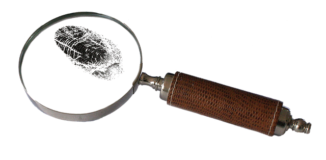

## Documento informatico, firma elettronica e digitale

Avv. Carlo Piana

Array https://array.eu

Milano, Bolzano, the Internet, 26 giugno 2020

---

## Do per scontato!

- Cos'è EIDAS e a cosa serve
- Cos'è il CAD
- Cos'è la Conservazione sostitutiva

---

## Il documento informatico

Poco in Eidas
- Aticolo 2.1.35

«documento elettronico», qualsiasi contenuto conservato in forma elettronica, in particolare testo o registrazione sonora, visiva o audiovisiva;

- Articolo 46 - Effetti giuridici dei documenti elettronici

A un documento elettronico non sono negati gli effetti giuridici e l’ammissibilità come prova in procedimenti giudiziali per il solo motivo della sua forma elettronica.

- Documento elettronico a cui viene apposta una firma digitale o elettronica (art. 20 CAD) @fa[arrow-right fa-green] **Forma Scritta** <!--frag index 4 -->

---

## Forma scritta per un documento elettronico

Qualità della firma:

- Avanzata @fa[arrow-right fa-green] Art. 26 EIDAS
- Qualificata @fa[arrow-right fa-green] Art. 29 EIDAS
- Digitale @fa[arrow-right fa-green] Art. 24 CAD
- Firma Art. 20 CAD (SPID?)

---

## Cos'è una firma elettronica?

«firma elettronica»: dati in forma elettronica, acclusi oppure connessi tramite associazione logica ad altri dati elettronici e utilizzati dal firmatario per firmare (art. 3.1.10 EIDAS)

@far[meh-rolling-eyes fa-4x fa-green fragment]

---

## No, davvero, cos'è?

Un dispositivo logico e tecnico che consente di attribuire all'autore la paternità della sottoscrizione, perché solo lei/lui possedeva qualcosa e creare la firma.

@far[flushed fa-4x fa-green fragment]

----

## Facciamo un passo indietro

Cifratura a chiavi asimmetriche:

- Tizio ha un messaggio per Caio, che solo Caio deve poter aprire
- Caio rende **pubblica** una **chiave** con cui si può solo cifrare. Decifrare è praticamente impossibile
- Per decifrare occorre una chiave **privata**
- Caio ha la chiave privata che corrisponde alla chiave pubblicata
- <!--frag--> **Bingo**! @fa[bomb ]

---

## E la firma?

<!--frag--> La firma è l'inverso della cifratura.

- <!--frag--> La chiave **pubblica** è quella di **decifratura**
- <!--frag--> La chiave **privata** è quella di **cifratura**
- <!--frag--> Chi firma **cifra** il documento con la chiave privata
- <!--frag--> Chi verifica la firma **decifra** la firma con la chiave pubblica
- <!--frag--> Se la decifratura riesce, dimostra che il firmatario era in possesso della chiave privata
- <!--frag--> Se riesce, significa che il messaggio non è stato alterato

---

<!-- .slide:  data-background-image="assets/img/firma-digitale.webp" data-background-size="contain" -->

---

## Come si autentica la firma?

Meccanismo della qualificazione:

- La firma contiene alcuni dati che **individuano** il sottoscrittore
- La firma è a sua volta **firmata** da un ente terzo (**Certification Authority**)
- Il certificato della Certification Authority è Pubblico
- L'elenco delle Certification Authority è pubblico ed esiste un'autorità di **root** (RootCA) che certifica i certificatori.
- In Italia, **DigitPA**.

----

## Firma qualificata valida allorché

- <!--frag-->La firma si basa su un **certificato qualificato**
- <!--frag-->Il certificato è qualificato quando è emesso da un ente certificatore autorizzato.
- <!--frag-->La firma risulta apposta con tale certificato e corrisponde al documento (hash)
- <!--frag-->Requisiti ulteriori

---

## Effetti della firma valida

- **Authenticity** Il messaggio proviene da una fonte autentica
- **Non repudiation** La fonte autentica non è in grado di dissociarsi da ciò che ha firmato
- **Integrity** Il contenuto del messaggio non è stato alterato

---

## Cosa serve per "convalidare" una firma?

- **Software di validazione**
- <!--frag--> Il certificato della CA per convalidare il certificato del firmatario
- <!--frag--> Il certificato della RootCA per convalidare il certificato della CA
- <!--frag--> @fa[exclamation fa-strong] La Certification Revocation List (**CRL**)
- <!--frag--> @fa[exclamation fa-strong]@fa[exclamation fa-strong] Un orologio e un calendario

<!--frag-->@fa[question fa-strong fa-2x]

---

## Un certificato non è per sempre

- <!--frag-->Il possessore può perdere il certificato o questo può essere rubato
- <!--frag-->Il possessore "denuncia" la perdita
- <!--frag-->Il certificato viene inserito in un lista di revoca, la **CRL**
- <!--frag-->Chi valida il certificato **deve** controllare la CRL (tipicamente ogni 24 ore)
- <!--frag-->Una firma apposta con un certificato **revocato** **non è valida**

----

## Un certificato non è per sempre, reloaded

- <!--frag-->Il certificato **scade** <!--frag-->
- <!--frag-->Il certificato **può venire revocato** <!--frag-->
- <!--frag-->Dunque è necessario conoscere il **tempo della firma**
- <!--frag-->Firma apposta **prima** della **scadenza** e della **revoca** è salva

<!--frag fade-right center-img -->

---

## Riferimento temporale

Colloca la firma in un orizzonte temporale precedente la revoca o la scadenza

@fa[arrow-down center-img fa-2x fa-green fragment]

<!--frag index --> **Firma valida**

---

## Validi riferimenti temporali

Art. 41 delle Regole Tecniche (Dpcm 22/2/2013 n. 68380)

- Marca temporale (41.1)
- Segnatura di protocollo (41.1.a)
- **Conservazione sostitutiva** (41.1.b)
- Messaggio di PEC (ma anche quello scade) (41.1.c)
- Marcatura postale elettronica (41.1.d)

---

# Ma quale firma?

---

## Ricapitolando

- Avanzata @fa[arrow-right fa-green] Art. 26 EIDAS
- Qualificata @fa[arrow-right fa-green] Art. 29 EIDAS
- Digitale @fa[arrow-right fa-green] Art. 24 CAD
- Firma Art. 20 CAD (SPID?)

---

## Firma avanzata

Articolo 26

Requisiti di una firma elettronica avanzata

Una firma elettronica avanzata soddisfa i seguenti requisiti:

a) è connessa unicamente al firmatario;

b) è idonea a identificare il firmatario;

c) è creata mediante dati per la creazione di una firma elettronica che il firmatario può, con un elevato livello di sicurezza, utilizzare sotto il proprio esclusivo controllo; e

d) è collegata ai dati sottoscritti in modo da consentire l’identificazione di ogni successiva modifica di tali dati.

---

## Firma Qualificata

«firma elettronica qualificata», una firma elettronica avanzata <strong>creata da un dispositivo per la creazione di una firma elettronica qualificata</strong> e basata su un certificato qualificato per firme elettroniche;

Requisiti: Allegato II EIDAS

---

## Firma Digitale

- Art. 1.1.s e 24 CAD (= Italiana)
- È una firma elettronica qualificata basata su chiavi assimmetriche e certificati qualificati.

---

# Firme EU

---

Art. 25.3 EIDAS

3.   Una firma elettronica qualificata basata su un certificato qualificato rilasciato in uno Stato membro è riconosciuta quale firma elettronica qualificata in tutti gli altri Stati membri.

Art. 27 EIDAS: Firme nel settore pubblico

1.   Se uno Stato membro richiede una firma elettronica avanzata per utilizzare i servizi online offerti da un organismo del settore pubblico, o per suo conto, tale Stato membro riconosce le firme elettroniche avanzate, le firme elettroniche avanzate basate su un certificato qualificato di firma elettronica e le firme elettroniche qualificate che almeno siano nei formati o utilizzino i metodi definiti negli atti di esecuzione di cui al paragrafo 5.

\[...\]

3\.   Gli Stati membri non richiedono, per un utilizzo transfrontaliero in un servizio online offerto da un organismo del settore pubblico, una firma elettronica dotata di un livello di garanzia di sicurezza più elevato di quello della firma elettronica qualificata.

---

# Firme non EU

---

## Stato dell'opera

- Estremamente complessa
- Per EIDAS va riconosciuta se vi sono accordi di reciprocità (art. 14.1)
- WTO, art. 49 Dlgs 50/2016 "condizioni non meno favorevoli"
- Reso parere ad ACP

  @fa[arrow-down fa-green fa-2x]

----

## Il Parere ACP

«In caso di operatori stabiliti al di fuori dell’Unione Europea e senza una rappresentanza stabile nel territorio dell’Unione, sempreché lo Stato di stabilimento non abbia concluso un accordo ai sensi dell’art. 14.1 EIDAS, il requisito di firma potrà essere soddisfatto utilizzando una firma elettronica avanzata secondo gli standard internazionalmente riconosciuti, purché vi sia evidenza che quella firma sia accettata nel paese di origine in caso di gare per [indicare il tipo di appalto, gara, avviso in corso]. In tal caso l’operatore economico dovrà fornire, in un documento anche non firmato, le modalità tramite le quali sia possibile per la stazione appaltante verificare l’autenticità della firma tramite una connessione online con l’autorità di certificazione.

In mancanza di tale indicazione, l’Amministrazione potrebbe non essere in grado di verificare l’autenticità della sottoscrizione, con conseguente esclusione.»

---

# Convalida

---

## Servizio fantasma

- Art. 32 Eidas
- Recentemente pubblicate linee guida (laconiche)
- Fornisce un'attestazione affidabile e sottoscritta del risultato di convalida
- Attualmente non sono noti servizi di convalida

---

## Nel frattempo...

- applicazioni realizzate da alcuni fornitori
  - Dike (Infocert)
  - Arubasign
- Servizi (Namirial)
- DSS https://joinup.ec.europa.eu/dss-webapp/validation (va e non va...)
- Molta fantasia e arte, soprattutto con le firme EIDAS

---

---

<!-- bkg thanks.jpg-->

## Thank you!

[<!-- .element: style="border-width:0" -->][CC-by-sa]

This work is licensed under a [Creative Commons - Attribution - ShareAlike][CC-by-sa]

Presentation made using [Reveal.js][81aa3153] and a [Markdown][81aa3154] workflow with [reveal-md](https://github.com/webpro/reveal-md)

  [CC-by-sa]: http://creativecommons.org/licenses/by-sa/4.0/
  [81aa3153]: https://revealjs.com/ "Reveal"
  [81aa3154]: https://daringfireball.net/projects/markdown/syntax
