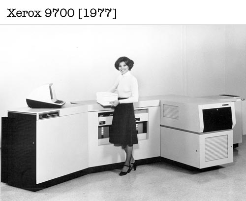

# Software libero e open source

### un'introduzione

Carlo Piana  
**Array** studio legale  
https://array.eu

---

## aree coperte

- Framework legale
- Compliance
- Licensing e modelli di business

---
# Framework legale

---

## Come viene protetto il software

- Copyright
- Brevetti
- Segreto industriale
- *database rights (sui generis rights)*

---

## Copyright

- Un diritto armonizzato:
  - nel mondo @fa[globe fa-strong]
    - <!--frag--> Convenzione di Berna
    - <!--frag--> Convenzioni WIPO
  - <!--frag--> In Europa  
    - <!--frag--> Direttiva Infosoc (1991)
    - <!--frag--> Direttiva Software (ultima: 2009)
  - <!--frag--> In Italia
    - <!--frag--> Legge sul Diritto d'Autore (**LDA**)
    - <!--frag--> Art. 64bis-quater LDA, Art. 171 bis LDA

---

## Come si acquista il Copyright

- automaticamente
- senza bisogno di registrazione
- senza bisogno di "claim"
  - <i class="fa fa-copyright fa-strong"></i>
- fissazione su un supporto durevole

----

## Cosa protegge il Copyright

- opere **originali**
- <!--frag--> **elaborazioni originali** di opere originali
- <!--frag--> Non protegge l'idea in sé
- <!--frag--> Non protegge **fatti**

----
## Diritti concessi

- Esclusive: diritti economici
  - Copia
  - Esecuzione
  - Modifica
  - Traduzione, ecc.
- Diritti morali (campo minato)

---

## Reverse engineering (segreto)

- Studi osservazionali
  - <!--frag--> Sempre ammessi
  - <!--frag--> Possibile ricreare un clone funzionale
- <!--frag--> Decompilazione @fa[exclamation-triangle fa-red fragment]
  - <!--frag--> Possibile a certe condizioni (art 64 quater LDA)

---

## Brevetti

- Teoricamente, non ammessi
  - Art. 52.2(c) European Patent Convention
  - Ma solo "as such" (Art. 52.3)
- Di fatto ampiamente concessi
- In certe aree (audio/video, per esempio) sono un problema da affrontare

---
<!-- bkg --> questions.jpg

<!-- .element class="dom" -->
# @fa[question-circle] Domande

---

## Sfruttamento del copyright nel software

- Uso in proprio
- Vendita
- SaaS/PaaS ecc. (servizi)
- Software libero / Open source
- Modelli misti

---

## Licenze pubbliche

- Permesso dato a chiunque
- Con una **licenza**
  - One-to-many
  - Anche all'insaputa (!)
- Direttamente nel codice

---

### Le quattro libertà del software

- To **run** the program (_freedom 0_).
- To **study** how the program works, **and change** it.(_freedom 1_).
- To **redistribute copies** so you can help your neighbor (_freedom 2_).
- To distribute copies of **your modified versions** to others (_freedom 3_).

---

## Open source definition (OSD)

- Gestita da OSI (Open Source Initiative)
- "Certifica" l'aderenza delle singole licenze all'OSD
- "Open Source" a rigore è solo "OSD-compliant"
- Open Source o Software Libero? (cenni)

---

 <!-- .element: class="center-img" -->

A printer...
---

## Qual era il problema?

- Software inizialmente libero trasformato in proprietario
- Impossibilità di beneficiare delle 4 libertà
- <!--frag--> <strong>Come risolvere?</strong>

---
 <!-- .element: class="center-img" -->

Copyleft (@fa[copyright fa-spin fa-red])  Copyright reversed

---

## Copyleft

- Uso del copyright per mantenere uno stato di libertà/apertura
- Condizioni di licenza
  - Ti do il permesso **se...**
- Le condizioni sono usate per mantenere il codice libero (open, aperto)
- Per l'opera originale e per ogni **opera derivata**
- Sia legalmente che tecnicamente (tramite condizioni) <i class="fa fa-arrow-down fa-strong"></i>

----

## Condizioni copyleft (principali)

- Condividere il **codice sorgente** (senza costi aggiuntivi, senza altre condizioni)
- Opere *derivate* sotto la **stessa licenza** dell'originale *("share alike")*
- Fornire **copia** della licenza

---

## Opere derivate

- Nessuna definizione in LDA
  - Elaborazioni originali di un'opera
  - Appartiene a chi l'ha elaborata
  - Salvo permesso autore originale
- Nelle opere letterarie?
  - Traduzione, Riduzione, Adattamento...
- Nel software?

---
<!--bkg--> link.jpg

# Linking

----

## Static linking v. dynamic linking

- static = merge at compile time
  - NO - NO
- dynamic = merge at run time (= dall'utente)
  - NO/YES
- Le cose si fanno complicate

---

## Tre tipi di Copyleft

Le licenze open source possono essere raggruppate per l'intensità del copyleft:

- No copyleft
- Weak copyleft
- Strong copyleft

----

## No copyleft

- Non si ha necessariamente il **codice sorgente** a disposizione
- Non ci sono particolari condizioni sulla **licenza** da applicare a _qualsiasi_ opera derivata
- Facile proprietarizzazione
- Esempi: Apache, BSD, MIT

----

## Strong copyleft

- Tutte le **opere derivate**
- Non "mere aggregazioni"
- Esempi: GPL

----

## Weak copyleft

- Stesse condizioni del copyleft forte
- Cambia l'**oggetto**: solo la libreria/il file
- No dynamic linking
- Esempi: LGPL, Mozilla, Eclipse

----

## Network copyleft

- ASP loophole
- Costringere copyleft in assenza di distribuzione
- Trigger da "copia e distribuzione pubblica" a "modifica"
- Esempi: AGPL (Affero GPL)

---

## Proliferation

- Numero enorme di licenze
- \> 80 approvate OSI
- Long tail - poche veramente rilevanti
- Incompatibilità (rinvio)

---
<!-- bkg --> questions.jpg

<!-- .element class="dom" -->
# @fa[question-circle] Domande
---

# Compliance

---

## Compatibilità

- Diverse licenze @fa[arrow-right] diverse condizioni
- Copyleft @fa[arrow-right] oggetto @fa[arrow-right] rispetta "**inbound**"
- Licensing **inbound** @fa[arrow-right] licensing **outbound**

----

## Esempi

- Inbound: BSD + Apache 2 @fa[arrow-right] GLP v.3 @fa[check fa-green]
- Inbound: Mozilla v.2 + _Eclipse_ @fa[arrow-right] GPL v.3 @fa[exclamation-triangle fa-red]
- Inbound: Mozilla v.2 + GPL v.3 @fa[arrow-right] GPL v.3 @fa[check fa-green]
- Inbound: GPL v.2 @fa[arrow-right] GPL v. 3 @fa[exclamation-triangle fa-red]

---

## Strumenti per garantire la provenienza

- Contrattuali (garanzie)
- Check ex post (banche dati)
- Qualità
- Community

----

## Controlli contrattuali

- Garanzia che tutto il codice sia **originale**
- Garanzia che tutto il codice non originale sia stato **correttamente licenziato** (lista?)
  - Licenze pubbliche
  - Licenze private
- Garanzia che tutto il codice sia stato acquisito da soggetti "**certificati**"
- Obbligo sostituzione + hold harmless

----

## Check ex post

- Audit
- Banche dati
  - [Fossology][065e6644]
  - [Blackduck][3d9f2d1a]
  - ...
- Altri (es **Binary Analysis Tool**)

  [065e6644]: https://www.fossology.org/ "Fossology"
  [3d9f2d1a]: https://www.blackducksoftware.com/ "Black Duck"

----

## Qualità

- **Open Chain** [project][a013520c]
  - leggera
  - creata dalla Linux Foundation
  - Traduzione in italiano (la sto facendo...)
  - "interfacce" standard.
- Elementi di compliance interna (altri processi, procedure)
- Utilizzo di [SPDX](https://spdx.org/) Per automatizzare le informazioni delle licenze

  [a013520c]: https://openchainproject.org "Open Chain website"

----

## Community

Community can screw up pretty bad

- Contribution Assignment Agreement (**CAA**)
- Contribution Licensing Agreement (**CLA**)
- Fiduciary Licensing Agreement (**FLA**)
- Developer's Certificate of Origin (**DCO**)
  - embeddable in Github

---?image=assets/questions.jpg

<!-- .element class="dom" -->
# @fa[question-circle] Domande

---

# Interazioni licenze @fa[arrow-right] modelli di business

----

## Principali modelli di sviluppo
### (rinvio)

- Distributed
- Silos
- Silos + contributi esterni + assegnazione (CAA/CLA)

---

## Principali modelli di Sfruttamento

- Subscription pura
- Dual Licensing
- Hardware
- Utilizzo interno
- SaaS / PaaS
- Open Core

----

## Subscription pura

- Comunità di svilppo distribuita
- Licenze di ogni tipo @fa[arrow-right]  
 outbound + inbound copyleft@fa[check fa-green]

----

## Dual Licensing

- Comunità di sviluppo non essenziale (Tipicamente silos)
- Concentrazione del copyright (CAA+CLA)
- Licenze inbound solo weak + no copyleft
- Licenze outbound **strong** copyleft (massimo)
  - contemporaneamente licenza proprietaria
  - "selling exceptions"

----

## Open Core

- Piattaforma centrale pubblica
- Aggiunte a maggior valore proprietarie
- Licenza outbound (core) tipicamente permissiva (no- o weak- copyleft)

----

## Hardware

- Software embedded
- Molto usato in appliance
- Comunque distribuzione @fa[arrow-right] compliance inbound/outbound

----

## SaaS/PaaS

- Non c'è distribuzione
- Copyleft non si estende a uso interno senza distribuzione
- Inbound: qualsiasi | outbound non necessaria.
  - "_have the cake and eat it_"

---?image=assets/questions.jpg

<!-- .element class="dom" -->
# @fa[question-circle] Domande

---?image=assets/thanks.jpg
<!-- .slide: data-background-transition="none" -->

# Grazie

per approfondimenti:  

[Brevi cenni sull'universo (aperto)](http://www.techeconomy.it/2015/09/11/brevi-cenni-sulluniverso-aperto/)  

[Licenze di software libero e modelli di business](http://www.techeconomy.it/2015/12/04/licenze-software-libero-modelli-business/)  

[Una breve storia personale del software libero (open source)](http://www.techeconomy.it/2015/10/14/breve-storia-personale-software-libero-open-source/)  

[Le licenze di software libero (open source)](http://www.techeconomy.it/2015/11/13/licenze-software-libero-open-source/)  

---

@fa[copyright fa-red fa-lg] 2020 - Carlo Piana (some rights reserved)   
Licenza Creative Commons by-SA 4.0 unported.  

 This work is licensed under a <a rel="license" href="http://creativecommons.org/licenses/by-sa/4.0/">Creative Commons Attribution-ShareAlike 4.0 International License</a>.  

Le immagini sono tutte in pubblico dominio / CC-0 tranne l'immagine della fotocopiatrice Xerox

Presentazione realizzata con [Gitpitch](https://gitpitch.com/) e [Reveal.js][81aa3153]

  [81aa3153]: https://revealjs.com/ "Reveal"
