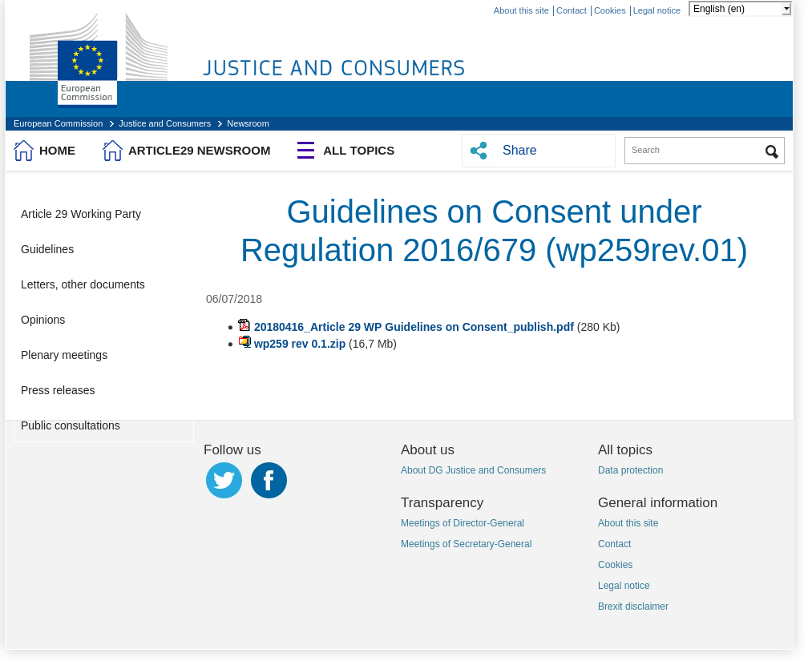
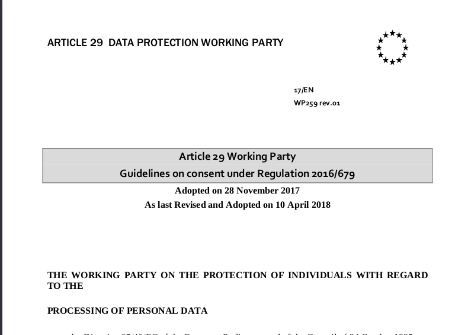

# Il consenso per i figli nella scuola non è (quasi) mai libero

Carlo Piana

**Array**
  https://array.eu

Bolzano, Internet, 25 aprile 2020

---
## Basi giuridiche

Il trattamento deve basarsi su una base giuridica:

- consenso
- contratto
- obbligo di legge
- interesse vitale di un terzo
- interesse prevalente del titolare

---

## Consenso

- Libero
- Espresso
- Informato

---

 <!-- .element class="center-img-large" -->

---

 <!-- .element class="center-img-large" -->

----

# Consenso Libero

> The element “*free*” <!--frag highlight-bold--> implies *real choice* <!--frag highlight-bold--> and control for data subjects. As a general rule, the GDPR
> prescribes that if the data subject has no real choice, *feels compelled*<!--frag highlight-bold--> to consent or will endure
*negative consequences*<!--frag highlight-bold--> if they do not consent, then consent *will not be valid*.<!--frag highlight-bold-->

----

# Senza timore di soffrire conseguenze negative

> If consent is bundled
up as a non-negotiable part of terms and conditions it is presumed not to have been freely given.
Accordingly, consent will not be considered to be free if the data subject is **unable to refuse or
withdraw** his or her consent **without detriment**.

----
# Tra pari, senza soggezione al potere

> The notion of *imbalance* between the controller
and the data subject is also taken into consideration by the GDPR.

---
## Applichiamo alle piattaforme

- <!--frag fade-in-then-semi-out --> La classe adotta una piattaforma
- <!--frag fade-in-then-semi-out --> Questa Piattaforma è una per tutti
- <!--frag--> Questa piattaforma trasferisce i dati **a terzi** <!--frag-->
- <!--frag--> Serve un **Consenso specifico** <!--frag-->
- <!--frag--> Cosa succede se uno studente nega? @fa[exclamation-triangle fa-red fragment]

----

## Una proposta che non si può rifiutare

<!--frag fade-right center-img-large -->

---
## Coseguenze

- Timore sul **rendimento**
- Timore sulla **valutazione**
- Timore di **effetto paria** (pressione sociale)

---
## Cosa fare?

- Voto unanime e segreto @fa[question-circle fa-red fragment ]
- <!--frag--> Non mettere lo studente in condizioni di dover accettare
- <!--frag--> Soluzioni alternative: **self hosted** <!--frag-->
- <!--frag--> Se non possibile (?!), offrire almeno alternative (ma ve ne sono? È fattibile?)

---
## Esempi

<!--frag--> Noi abbiamo lavorato a Jitsi self-hosted (Documentazione)

<!--frag--> <https://jitsi-club.gitlab.io/jitsi-self-hosting/en/>

<!--frag--> Questo servizio da cui parliamo ([BBB](https://bigbluebutton.org/))<!--frag-->
---
<!-- bkg thanks.jpg-->

## Grazie!

[<!-- .element: style="border-width:0" -->][CC0]

This work is licensed under a [Creative Commons - zero International License][CC0]

Presentation made using [Reveal.js][81aa3153] and a [Markdown][81aa3154] workflow with [reveal-md](https://github.com/webpro/reveal-md)

  [CC0]: http://creativecommons.org/publicdomain/zero/1.0/
  [81aa3153]: https://revealjs.com/ "Reveal"
  [81aa3154]: https://daringfireball.net/projects/markdown/syntax
