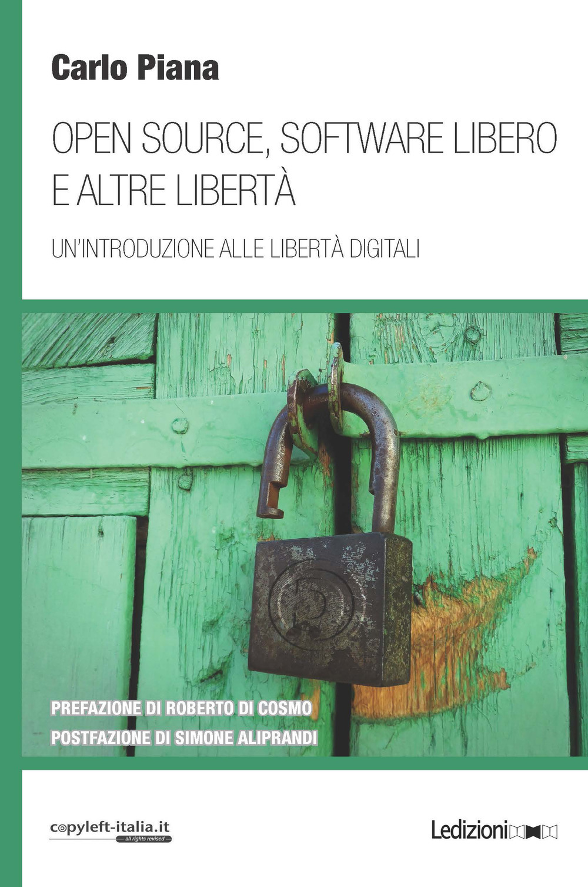

# Free Software Legal 101

## FSFE Track

Carlo Piana

**Array**
  https://array.eu

Bolzano, 16 November 2019

---
# Why?

---
<!-- img --> questions.jpg
---

## No Software Comes Without Licence Tag

You think that because there is no licensing condition attached to the software, there is no restriction? **Think better!**

- <!--frag--> Full copyright is by *default*
- <!--frag--> Seek license                 
- <!--frag--> Without a licence (or *license*), you are stuck with statutory provisions

---
## Inbound vs Outbound Licensing, derivative software

Nobody writes software from scratch!

- <!--frag--> You take some code
- <!--frag--> That code has its own conditions
- <!--frag--> Conditions of software you are reusing is called **inbound**
- <!--frag--> Conditions of software you are *distributing* is called **outbound**
- <!--frag--> If software contains substantial fragments of other software, it is a **derivative**.
- <!--frag--> Derivative software needs permission from the original(s)

---

# Why is it important to know?

A license can be very simple and just permit whatever to whomever. But with most licenses, **permission** is granted only *provided that* you comply with **conditions**

- <!--frag--> **If** condition is complied with, **then** you can {modify, distribute original or modified software}
- <!--frag-->  **If** condition **is not** complied with, **then** you cannot {modify, distribute original or modified software}

----

## Is this "copyleft"?

No, copyleft is a *subclass* of  Free Software conditions.

- <!--frag--> Conditions impact on **outbound** software, and outbound license
- <!--frag--> One condition is **"inbound license == outbound license"**
- <!--frag--> Depending on the scope of this condition (just the library, the file or the entire derivative), we have **"strong"** or **"weak copyleft"**

---

## A Clash of Licenses

The more conditions and the stricter, the more likely you have **incompatibilities**: there is no state in which you can comply with both.

---

## Compliance

Means *respect* conditions upon which you receive a Free Software *grant*

---

# How?

---

## Different strategies

- <!--frag--> SPDX, Reuse
- <!--frag--> Standards procedures (OpenChain)
- <!--frag--> Scanning

----

## SPDX

Software Package Data Exchange

* An open *standard* to communicate data about components, their licensing conditions and more
* <https://spdx.org/>

----

## Reuse

* Tools and processes to make sure you offer simple and complete licensing information
* <https://reuse.software/>

----

## Standards

**OpenChain**, a full legal compliance standard to show you have set up processes, training, documentation, to ensure compliance in your own organization and to demonstrate it.

Find more at <https://www.openchainproject.org/>

----

## Scanning

- <!--frag--> Only for more complex projects, with many packages
- <!--frag--> Two goals:
  - <!--frag--> "find cheaters"
  - <!--frag--> find accurate licensing information in the text and record them
- <!--frag--> Most popular: **Fossology** (open source project)
- <!--frag--> Needs to be included in CD/CI:
- <!--frag--> CD/CI/**CC** <!--frag-->
- <!--frag--> DepTree

---

## Where to find help

<!--frag-->FSFE's legal team <https://fsfe.org/activities/ftf/activities.en.html>

<!--frag--> Talk to us

---

## Where to find out more (advertisement)

 <!-- .element: class="center-img" -->

---
<!-- img --> thanks.jpg

## Thank you!

[<!-- .element: style="border-width:0" -->][CC0]

This work is licensed under a [Creative Commons - zero International License][CC0]

Presentation made using [Reveal.js][81aa3153] and a [Markdown][81aa3154] workflow

  [CC0]: http://creativecommons.org/publicdomain/zero/1.0/
  [81aa3153]: https://revealjs.com/ "Reveal"
  [81aa3154]: https://daringfireball.net/projects/markdown/syntax
